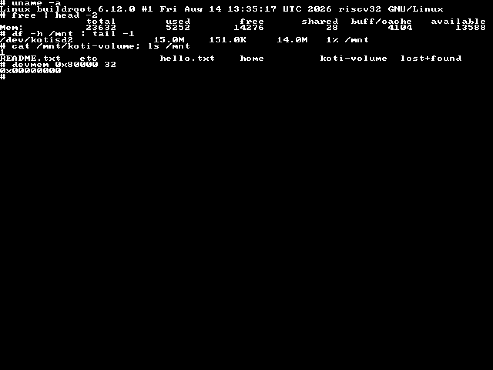
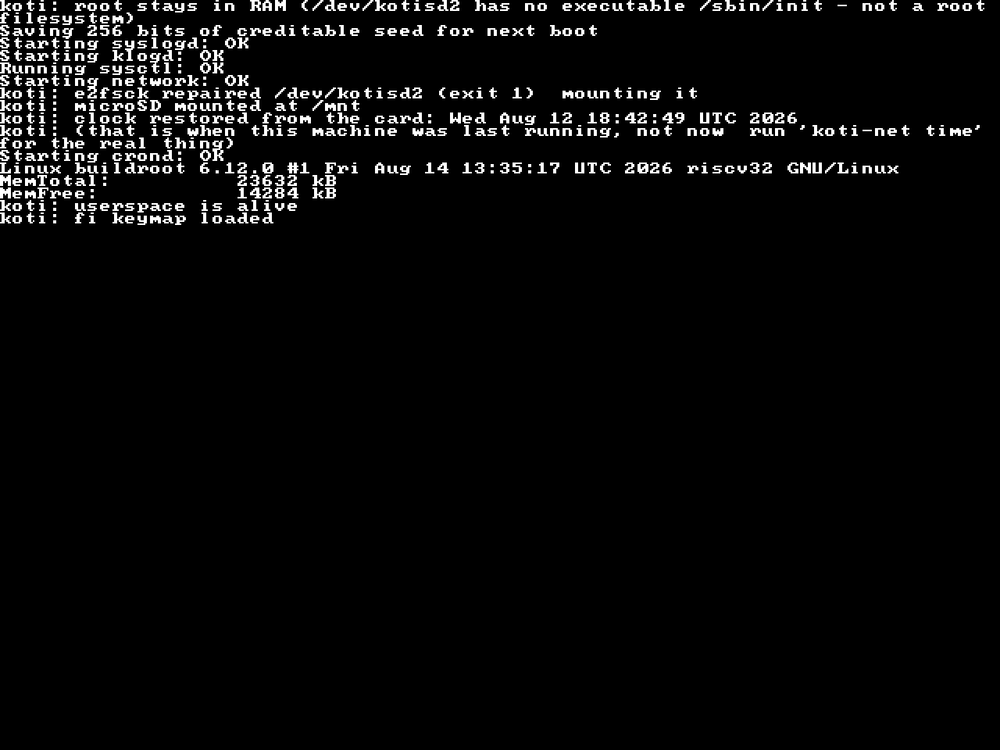

# Koti — a home computer, built from the CPU up

*Koti* (Finnish: "home", from *kotitietokone* — home computer.)

A computer you can sit down at: an RV32IMA CPU with an sv32 MMU, 32 MB of
SDRAM, a microSD filesystem, an HDMI screen, a USB keyboard, a way onto the
internet and a voice — running mainline Linux 6.12 on a ULX3S 85F FPGA board.

Every instruction it executes runs on a CPU in this repository. Not a demo that
boots once for a photograph: you power it from a phone charger, log in, fetch a
web page and write a file that is still there tomorrow.



> koti's 80x60 text console. **Rendered, not photographed** — `tools/screenshot.py`
> lays out a real UART capture using the hardware's own font ROM
> (`src/font_rom.svh`), the cell geometry from `src/vga_text.sv` and the wrap
> and scroll rules from `sw/console.c`. Every pixel is decided by something in
> this repository.

## What works, on real hardware

Every line below has been seen on the bench, not only in simulation.

| | |
| --- | --- |
| **CPU** | RV32IMA + Zicsr, M/S/U privilege, **sv32 MMU**, CLINT, PLIC, precise traps |
| **Caches** | I-cache and D-cache; the D-cache is **4.5% faster measured on the board**, two runs per arm |
| **Memory** | 32 MB onboard SDRAM, all of it addressable; the full window walked with an address-derived pattern, 0 errors |
| **Storage** | microSD, **read and write**, ext2 — files survive a power cycle |
| **Screen** | HDMI (GPDI), 640x480, **80x60** text console driven by koti's own `struct consw` |
| **Keyboard** | USB HID on US2, Finnish layout, a real input device |
| **Internet** | **fetches a web page by name** — DNS, TCP and HTTP, through the onboard ESP32 as a modem |
| **Sound** | 4 voices onto the board's own 3.5 mm jack; terminal bell plus `koti play` |
| **Clock** | 🔋 **battery-backed, and it keeps time with the board unplugged** — the ULX3S's own MCP7940N on koti's bit-banged I2C, `rtc0` by DT alias, read by the kernel before userspace. Proven 2026-08-15 on a cold boot with **power fully removed for >30 s**, standalone. A DS3231 on J1 becomes `rtc1`: gateware, driver and devicetree are in, ⏳ the module has not arrived |
| **OS** | mainline **Linux 6.12** riscv32, busybox userspace, ~280 applets |
| **Boot** | own M-mode SBI firmware loads the kernel off the card into RAM, ~49 s to a login prompt |
| **Standalone** | its own bitstream in the board's flash: **phone charger, no PC** |

```
buildroot login: root
# uname -a
Linux buildroot 6.12.0 #1 riscv32 GNU/Linux
# koti-net get http://example.com/
HTTP/1.1 200 OK
Content-Type: text/html
...
<h1>Example Domain</h1>
# koti play ode
# mount -o rw /dev/kotisd2 /mnt
# echo koti wrote this > /mnt/hello.txt
# sync ; umount /mnt ; mount /dev/kotisd2 /mnt
# cat /mnt/hello.txt
koti wrote this
```

The unmount in there is the point: it drops the page cache, so the last `cat`
genuinely read those bytes back off the card.

### The first website, fetched by a computer built from the CPU up

`info.cern.ch` has served the same page since 1993. This is koti asking for it —
captured off the machine's own console, not reconstructed:

```
# koti-net get http://info.cern.ch/
HTTP/1.1 200 OK
Date: Wed, 19 Aug 2026 16:37:39 GMT
Server: Apache
Last-Modified: Wed, 05 Feb 2014 16:00:31 GMT
ETag: "286-4f1aadb3105c0"
Accept-Ranges: bytes
Content-Length: 646
Connection: close
Content-Type: text/html

<html><head></head><body><header>
<title>http://info.cern.ch</title>
</header>

<h1>http://info.cern.ch - home of the first website</h1>
<p>From here you can:</p>
<ul>
<li><a href="http://info.cern.ch/hypertext/WWW/TheProject.html">Browse the first website</a></li>
<li><a href="http://line-mode.cern.ch/www/hypertext/WWW/TheProject.html">Browse the first website using the line-mode browser simulator</a></li>
<li><a href="http://home.web.cern.ch/topics/birth-web">Learn about the birth of the web</a></li>
<li><a href="http://home.web.cern.ch/about">Learn about CERN, the physics laboratory where the web was born</a></li>
</ul>
</body></html>
```

Every layer under that request is in this repository. The name was resolved and
the socket opened by an ESP32 acting as a modem on a serial link koti drives;
the bytes crossed a UART written here, into a kernel driver written here, on a
CPU written here, executing from SDRAM through a controller and a cache written
here. `Content-Length: 646`, and all 646 arrived — the link destroys the first
byte of every transmission burst, which is why the reply is buffered whole on
the far side and handed over in one piece rather than read in fragments.

## What it costs on the FPGA

From `nextpnr.log` of the shipped build (`a65390a`, ECP5 **LFE5U-85F**) — the
whole computer, CPU through video, storage, USB, modem and sound:

| resource | used | of | |
| --- | --- | --- | --- |
| LUT4 | 16712 | 83640 | **19%** (14804 as logic) |
| flip-flops | 6282 | 83640 | **7%** |
| block RAM | 23 | 208 | **11%** — 414 kbit, mostly caches and the firmware |
| DSP (MULT18X18D) | 4 | 156 | 2% — the multiplier |
| I/O | 101 | 365 | 27% |
| PLL | 3 | 4 | 75% |

**Fmax 28.44 MHz** against a 25 MHz system clock, so about 14% of margin.
The HDMI serialiser runs in its own 125 MHz domain and the USB host in a 12 MHz
one; only `clk_25mhz` is koti's speed.

⚠️ Read that number out of the run's `nextpnr.log`, taking the **last**
occurrence per clock — nextpnr prints each Fmax twice and the first is a
post-placement estimate that routinely reports a failure the routed design
passes. Every number here moves whenever `src/` does.

## The internet, honestly described

koti has **no IP address**. It has no MAC and no PHY, so `ip`, `ping` and
`wget` exist as busybox applets and all still fail — that is expected, not a
fault.

What it has instead is a **modem**. The ULX3S carries an ESP32 beside the FPGA;
koti reaches it over a serial link of its own (`src/esp_uart.sv` →
`/dev/ttyKOTI0`), and `koti-net` drives its MicroPython WiFi stack by remote
control:

```
koti-net wake                     # release the ESP32 from reset
koti-net join <ssid> <password>   # prints the address it was given
koti-net get http://example.com/  # the page, on standard output
koti-net time                     # set the clock from a server's Date header
```

Getting a page back **by name** took longer than getting one by address, and
the reason is worth recording: the phone hotspot advertises an **IPv6** name
server, and the ESP32's IPv4-only lwIP keeps the first four bytes of `fe80::`
as its v4 resolver — `254.128.0.0`. Every lookup died while IPv4 routing worked
perfectly, which is exactly why dialling an address had always worked. The
repair has to live *inside the same REPL statement as the whole transaction*,
because the DHCP client re-applies the lease in the gaps between commands and
reconfiguring the interface resets an open connection.

## Sound

Four voices — square, triangle, noise, with volume — mixed to eight bits and
put onto the ULX3S's **onboard 3.5 mm jack**, which is a 4-bit R2R ladder
driven straight from FPGA pins. No Pmod, no header: the socket is the DAC.

```
koti play a4                      # a note
koti play ode                     # a melody
koti play --wave triangle c4 e4 g4 c5
printf '\a'                       # the terminal bell, through the kernel
```

The synth is vendored verbatim from a sibling project; the part written for
koti is `src/audio_r2r.sv`, and it exists because **four bits is not enough to
truncate to**. Dropping the low four bits makes the error a function of the
signal — distortion that tracks the waveform, worst on quiet sustained notes.
Instead the eight-bit sample is sigma-delta modulated to four bits at the full
25 MHz clock: 512 decisions per audio sample, the discarded bits carried into
the next one. Measured in `test/tb_audio.v`, the output average tracks the
input exactly at every level tested — including three sixteenths of a step,
which truncation cannot express.

The bell is an **input driver** (`sw/linux/koti_snd.c`), not a sound driver,
because Linux rings the bell through `kd_mksound()` and the input layer — the
same path the PC speaker uses. The kernel owns voice 0 and `koti play` owns
voice 1, so a bell arriving mid-tune cuts nothing off.

## Using it

**[docs/MANUAL.md](docs/MANUAL.md)** is the user manual: how to log in, what the
two consoles are and why output sometimes doubles, how storage works and how to
avoid losing a file to a journal-less ext2, the full command list, and the
things that are present but cannot work.

A short version lives **on the machine** — type `koti-help`, or ask
`koti help how do I save a file`. That is not redundancy: it is the manual you
can read while using the machine rather than beside it.

## What does not work yet

- **No TLS**, so `koti-net get` is http-only. The ESP32 has `ussl` and 4 MB of
  free heap, so this is a job rather than a wall.
- **`root=` is still the initramfs**, deliberately. Moving it is a config
  change, not work — but the block driver should be used in anger first.
- **ext2 has no journal.** `sync` before pulling the power.
- **Sound is tier 1**: notes and a bell. Sampled audio needs a fabric FIFO
  (koti has no DMA, and 8 kHz leaves ~3600 clocks per sample); an ALSA device
  is bigger than the RTL under it.
- **This is an FPGA project, and only an FPGA project.** Koti is not going to a
  shuttle, and the ASIC apparatus was removed rather than parked — the
  TinyTapeout flow files, the `gds`/`docs` workflows and the second RTL
  configuration are all gone. There is one build now, and it is the board.

## Boot, end to end



> The tail of a real boot, rendered the same way.

The SBI firmware lives in 32 KB of block RAM inside the FPGA and the kernel is
about 6 MB, so the kernel had nowhere to live — that gap was the last thing
between a machine that booted in simulation and one that booted on the bench:

| route | per attempt |
| --- | --- |
| over the 115200 UART | **~343 s** |
| baked into the bitstream | a place-and-route per kernel |
| **microSD** | **~4 s** |

`sw/sbi/sdboot.c` reads a header at LBA 2048, loads the image straight into
SDRAM at `0x0140_0000` and checksums it; the firmware then finds the RISC-V
Image magic it was already looking for and enters it. `tools/sdkernel.py` writes
that layout to a card.

⭐ The boot log appears on the monitor **before Linux has a console driver at
all**: SBI `console_putchar` writes the UART *and* the text buffer. Linux takes
the screen over later, and it does so without a handover — `VGA_BASE` is a
register, so `koticon` allocates its own page and repoints the raster.

## How it is tested

The gates in `.github/workflows/` are part of the design, because this project
keeps finding that a green badge can mean less than it looks:

- **the CPU** — 1252 muldiv vectors, directed pipeline tests, and the whole
  official `rv32ui`/`um`/`ua` suite
- **the boot** — Linux is booted to userspace in simulation on every push, in
  Verilator (~60x faster than iverilog, which is why it is affordable)
- **the peripherals** — per-block benches for the PLIC, the SD stack, the USB
  keyboard, the ESP32 link, the D-cache, the SDRAM and the audio DAC
- **the shell** — koti's own scripts run under **busybox**, the shell it ships
  with, including `koti-net get` end to end against a fake ESP32 that reproduces
  the link's measured faults: it echoes, destroys the first byte of every burst,
  loses what is written while it is executing, and lets DHCP undo a repair
- **the lists** — `test/check_sources.py` and `test/check_mmio.py` compare the
  files that must agree with each other. Adding a peripheral takes two edits in
  two files, and the three times only one was made, the machine looked like it
  was resetting

Each gate is checked in both directions: it must fail on the defect it was
written for, or it is decoration.

## Layout

- `src/` — the SoC: core, MMU/TLB, SDRAM, caches, arbiter, video, microSD, USB,
  ESP32 link, audio
- `sw/` — bare-metal images, the SBI firmware (`sw/sbi/`), Linux and its drivers
  (`sw/linux/`)
- `fpga/ulx3s/` — the board harness, the pin plan and its checkers, and the
  synthesis script
- `vendor/` — verbatim copies from elsewhere, with provenance and why each is
  vendored rather than written
- `tools/` — card writer, screen renderer, console driver, ROM generators
- `test/` — the benches; `.github/workflows/` runs them all on every push
- `docs/` — the [manual](docs/MANUAL.md) for using the machine, images, and
  finished work orders kept as stop signs

## Licence

Apache-2.0. See `vendor/README.md` for the provenance and licences of the
vendored cores.
